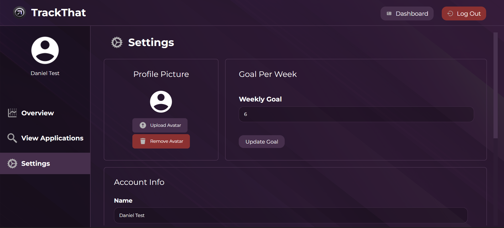

# TrackThat

**TrackThat** is a user-friendly web application designed to help individuals efficiently track, manage, and analyze their job or internship applications. Unlike traditional spreadsheets, TrackThat provides an intuitive interface, visual analytics, and features that simplify the job application process, empowering users to achieve their career goals.

## Features

- **User Authentication:** Secure sign-up and login functionality to ensure data privacy.
- **Application Tracker:**
  - Add, view, edit, and delete job applications.
  - Search and filter applications by key attributes.
- **Overview Dashboard:**
  - Displays key stats such as total applications, recent applications, and weekly goals.
  - Interactive pie chart summarizing application statuses.
- **Settings Page:**
  - Update account details such as username, email, and password.
  - Set weekly application goals to stay on track.
  - Toggle between light and dark modes for a personalized experience.
- **Responsive Design:** Optimized for usability across various devices.

## Architecture

TrackThat is built on a robust architecture focusing on scalability, security, and maintainability:

- **Frontend:** The React.js framework was selected for its component-based design, making it easier to create a professional and intuitive interface. Key pages include the landing page, dashboard, settings, and an application management view.
- **Backend:**
  - Built using FastAPI, which handles authentication and data management.
  - Follows REST principles, with routes organized into `/auth` for user authentication and `/applications` for managing job applications.
  - JWT tokens are used for authentication, ensuring secure access to protected routes.
  - OpenAPI specifications are implemented for API documentation, allowing comprehensive testing and debugging.
- **Database:** SQLite is used as a lightweight solution with indices on frequently queried columns (e.g., application status and date) to optimize performance. The database schema includes:
  - `User:` Stores user-related data for authentication.
  - `Application:` Tracks job applications associated with each user.
  - `Notes:` Allows users to add detailed notes tied to specific applications.
- **Security:**
  - Passwords are hashed using the HS256 algorithm.
  - Access tokens have short lifespans to minimize exposure risks.
  - Only resource owners can access their resources, ensuring robust data protection.

## Getting Started

To run our application you will only need to have Docker installed and an API key for [Logo.dev](https://www.logo.dev/). Our application can be ran in _regular_ and _development_ mode. Without diving to much into the details, if you want to run our application with hot reload enabled use the _development_ mode.

### Environment Variable Setup

#### Windows

There are multiple ways to set environment variables in Windows:

1. **Using Command Prompt**:

   ```
   setx VITE_API_KEY "your-logo-dev-api-key"
   ```

2. **Using PowerShell**:

   ```powershell
   $env:VITE_API_KEY = "your-logo-dev-api-key"
   ```

3. **System Environment Variables**:
   - Open System Properties (Win + Pause/Break)
   - Click "Environment Variables"
   - Under "User variables" or "System variables", click "New"
   - Variable name: `VITE_API_KEY`
   - Variable value: `your-logo-dev-api-key`

#### macOS

1. **Using Terminal**:

   ```bash
   export VITE_API_KEY="your-logo-dev-api-key"
   ```

2. **Permanent Setup (Bash/Zsh)**:
   Edit `~/.bash_profile` or `~/.zshrc`:
   ```bash
   export VITE_API_KEY="your-logo-dev-api-key"
   ```

#### Linux

1. **Using Terminal**:

   ```bash
   export VITE_API_KEY="your-logo-dev-api-key"
   ```

2. **Permanent Setup**:
   Edit `~/.bashrc` or `~/.bash_profile`:
   ```bash
   export VITE_API_KEY="your-logo-dev-api-key"
   ```

> **Alternative Method**: If you don't know how to set environment variables, you can create `TrackThat-Front-End/.env` and add this line `VITE_API_KEY=<your-key>` to the file.

### Running the Application

> For _development_ mode we use Docker mounts. Once you have cloned our repository just do the following:

1. Set a environment variable named `VITE_API_KEY` on your system whose value is your Logo.dev API key.

2. Run and build our application with the following commands:
#### Development Mode
`docker-compose -f docker-compose.yaml -f docker-compose.dev.yaml up --build`
#### Regular Mode
`docker-compose up --build`


> Notice the build flag `--build`. If you already have a Docker [container](https://www.docker.com/resources/what-container/) of our application you can omit the build flag.


### Troubleshooting Tips

- Ensure Docker is running before executing commands
- Verify your Logo.dev API key is correctly set
- Check that all required ports are available
- If using the `.env` file, ensure it's not tracked by version control (add to `.gitignore`)

### Common Gotchas

- On Windows, you might need to run Docker Desktop as an administrator
- Ensure you have the latest version of Docker Compose
- Some antivirus software may interfere with Docker - temporarily disable if you encounter unexpected issues

## Pictures





## Contact

- Daniel Dovale - ddovale2004@gmail.com
- Mauricio Mossi - mauricio.b.mossi@gmail.com
- Nattanon Nisup
- Luis Cabrera
