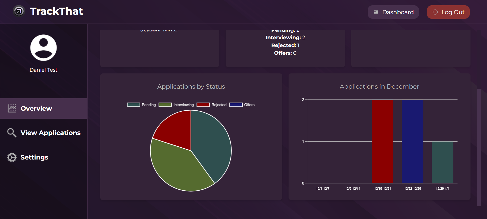

# TrackThat

**TrackThat** is a user-friendly web application designed to help individuals efficiently track, manage, and analyze their job or internship applications. Unlike traditional spreadsheets, TrackThat provides an intuitive interface, visual analytics, and features that simplify the job application process, empowering users to achieve their career goals.

## Features

- **User Authentication:** Secure sign-up and login functionality to ensure data privacy.
- **Application Tracker:**
    - Add, view, edit, and delete job applications.
    - Search and filter applications by key attributes.
- **Overview Dashboard:**
    - Displays key stats such as total applications, recent applications, and weekly goals.
    - Interactive pie chart summarizing application statuses.
- **Settings Page:**
    - Update account details such as username, email, and password.
    - Set weekly application goals to stay on track.
    - Toggle between light and dark modes for a personalized experience.
- **Responsive Design:** Optimized for usability across various devices.

## Architecture
TrackThat is built on a robust architecture focusing on scalability, security, and maintainability:

- **Frontend:** The React.js framework was selected for its component-based design, making it easier to create a professional and intuitive interface. Key pages include the landing page, dashboard, settings, and an application management view.
- **Backend:**
    -Built using Django REST Framework, which handles authentication and data management.
    - Follows REST principles, with routes organized into `/auth` for user authentication and `/applications` for managing job applications.
    - JWT tokens are used for authentication, ensuring secure access to protected routes.
    - OpenAPI specifications are implemented for API documentation, allowing comprehensive testing and debugging.
- **Database:** SQLite is used as a lightweight solution with indices on frequently queried columns (e.g., application status and date) to optimize performance. The database schema includes:
    - `User:` Stores user-related data for authentication.
    - `Application:` Tracks job applications associated with each user.
    - `Notes:` Allows users to add detailed notes tied to specific applications.
- **Security:**
    - Passwords are hashed using the HS256 algorithm.
    - Access tokens have short lifespans to minimize exposure risks.
    - Only resource owners can access their resources, ensuring robust data protection.

## Getting Started

## Pictures

## Contact

- Daniel Dovale - ddovale2004@gmail.com
- Mauricio Mossi
- Nattanon Nisup
- Luis Cabrera